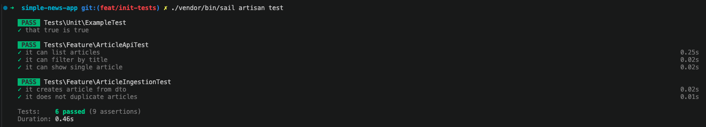

# 📰 Simple News App

A backend system built with Laravel for aggregating news articles from multiple external providers (e.g. NewsAPI, The Guardian, The New York Times).

The system normalizes external data, stores it in a unified structure, and exposes it through a consistent REST API with support for filtering, search, and user preferences.

---

## 📚 API Documentation

Full API documentation (Postman collection):  
👉 https://documenter.getpostman.com/view/6359426/2sBY4HV4bM

---

## 🚀 Tech Stack

- PHP 8+
- Laravel 13
- PostgreSQL
- Laravel HTTP Client
- Laravel Queues
- Laravel Scheduler
- PHPUnit (Feature & Unit Testing)
- Docker (Laravel Sail)

---

## 🧠 Architecture Overview

The system follows a **layered architecture with separation of concerns**:

### 1. External Providers Layer
Each news provider (e.g. Guardian, NewsAPI) implements a shared interface:

- `NewsProviderInterface`
- `GuardianProvider`, `NewsApiProvider`, etc.

Responsibilities:
- Fetch raw API data
- Transform raw payload → `ArticleDTO`

---

### 2. Data Transfer Layer (DTO)
`ArticleDTO` acts as a normalized contract between providers and the domain.

Benefits:
- consistent data structure
- isolation from external APIs
- improved testability

---

### 3. Ingestion Layer
`ArticleIngestionService`:
- persists articles
- resolves authors
- syncs categories
- ensures idempotency (`slug + source_id`, `external_id` can be used but some providers don't return id like News API provider.)

---

### 4. Repository Layer
`ArticleRepository`:
- encapsulates query logic
- supports filtering
- handles pagination
- eager loads relationships

---

### 5. API Layer
- `ArticleController`
- `ArticleResource`

Provides clean and consistent JSON responses.

---

### 6. Async Processing
- `news:sync` command
- queued jobs (`news-sync` queue)
- scheduled execution every 15 minutes

---

## 🧪 Tests

Run all tests:

```bash
php artisan test
```

### Test Coverage
* API feature tests (listing, filtering, single article)
* Ingestion tests (DTO → DB persistence)
* Duplication prevention tests

### Test Result Example


---

## 🧠 Design Decisions

### DTO-based ingestion
* Decouples external APIs from domain logic.

### Repository pattern
* Keeps controllers thin and query logic reusable.

### Queue-based sync
* Ensures scalable and non-blocking ingestion.

### JSON user preferences
* Simple and flexible initial approach.

---

## 🧠 Potential Enhancements (Future Considerations)

### 1. Improve deduplication strategy
* Enforce unique constraint on `(external_id, source_id)`

### 2. Improve provider orchestration
* Rate limiting per provider
* Retry policies
* Circuit breaker pattern
* requests on other data if applicable (pagination)

### 3. Add caching layer
* Redis caching for articles
* Cache provider responses

### 4. Normalize user preferences
Replace JSON with something like below:
* `user_sources`
* `user_categories`
* `user_authors`

### 5. Add observability
* Structured logging
* Ingestion metrics
* Queue monitoring

### 6. Add user-specific feeds
* User-specific feeds endpoint or by default on `/api/v1/articles`

### 7. Improve test coverage
* HTTP mock tests
* Performance tests
* Contract tests

### 8. Introduce Repository Layer for Remaining Models

Currently, some domain models are accessed directly within services such as `ArticleIngestionService`. To further improve separation of concerns and align with the existing architecture, a repository layer should be introduced for these models.

This would ensure that all data access logic is encapsulated within dedicated repositories and injected into services via dependency injection. It improves testability, consistency across the codebase, and adherence to the repository pattern already used in the `Article` domain.

---

## 🧠 Key Tradeoffs

| Decision | Tradeoff |
| :--- | :--- |
| **DTO layer** | Extra abstraction but better isolation |
| **Repository pattern** | More structure, more files |
| **Queue-based sync** | Eventual consistency |
| **JSON preferences** | Simplicity over normalization |

---

## 🚀 Getting Started

### Install dependencies
```bash
composer install
```

### Start environment (Laravel Sail)
```bash
./vendor/bin/sail up -d
```

### Run migrations
```bash
./vendor/bin/sail artisan migrate --seed
```

### Sync news manually
```bash
./vendor/bin/sail artisan news:sync
```

### Sync news automatically
```bash
* * * * * ./vendor/bin/sail artisan schedule:run >> /dev/null 2>&1
```

### Run queue worker
```bash
./vendor/bin/sail artisan queue:work --queue=news-sync
```

---

## 📌 Notes
* External providers are partially implemented for demo/testing purposes.
* System designed for extensibility and scalability.
* Focus on clean architecture and maintainability.